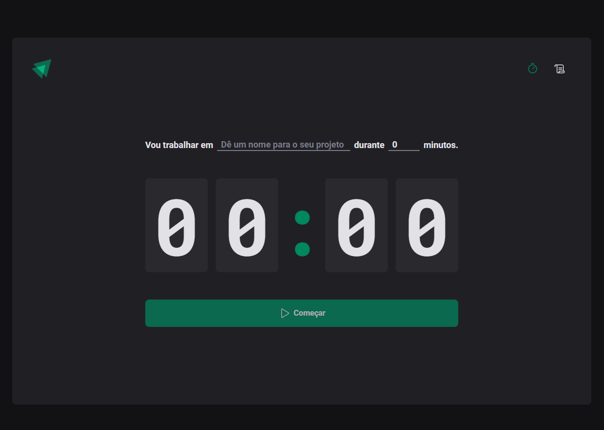
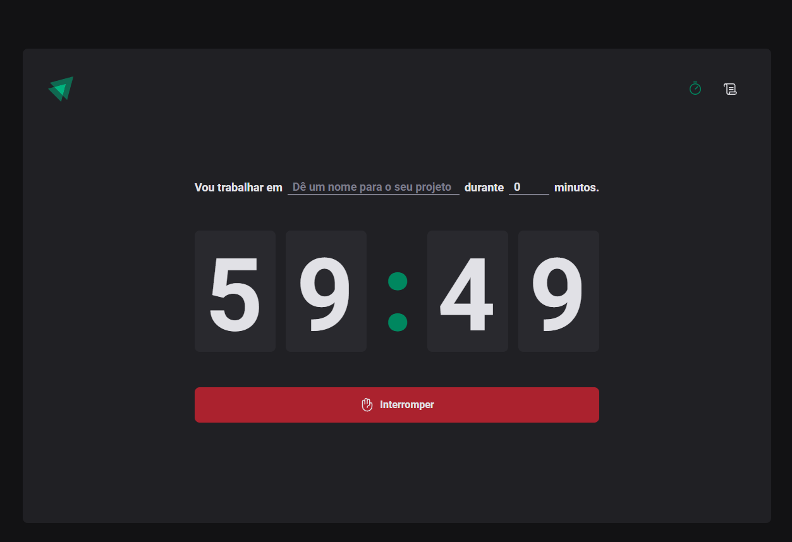
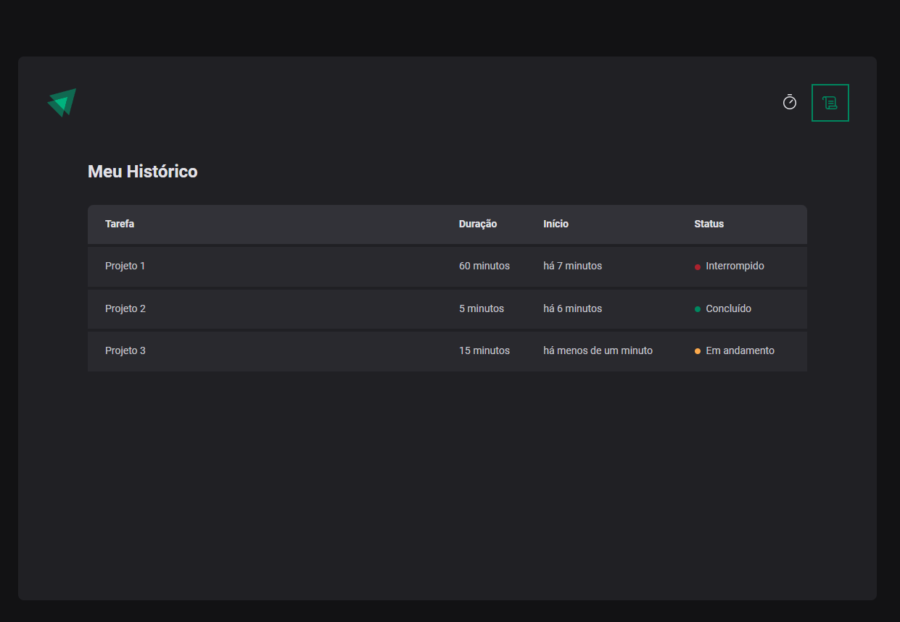

# Ignite Timer

## Descrição

O Ignite Timer é uma aplicação web completa desenvolvida com React, projetada para auxiliar na gestão do tempo através da técnica Pomodoro. Com uma interface intuitiva e funcionalidades robustas, ela permite que você *nomear suas tarefas*, *personalizar o tempo* e *acompanhar seu histórico*.







## Tecnologias

* **React:** Biblioteca JavaScript para construção de interfaces de usuário.
* **@hookform/resolvers:** Ferramenta para validação de formulários com React Hook Form.
* **immer:** Biblioteca para criação de cópias imutáveis de objetos, ideal para gerenciamento de estado.
* **react-hook-form:** Biblioteca para criação de formulários personalizados no React.
* **react-router-dom:** Biblioteca para gerenciamento de rotas em aplicações React.
* **styled-components:** Biblioteca para estilização de componentes CSS-in-JS.
* **zod:** Biblioteca de validação de dados TypeScript.

## Como executar o projeto

1. **Clone o repositório:**
  ```bash
  git clone https://github.com/faelperini/02-ignite-timer
  ```

2. **Instale as dependências:**
  ```bash
  cd 02-ignite-timer
  npm install
  ```

3. **Inicie o desenvolvimento:**
  ```Bash
  npm run dev
  ```

O aplicativo será iniciado em http://localhost:5173/

## Funcionalidades

**Nomear suas tarefas:** Defina um nome claro e conciso para cada atividade, facilitando a organização e o acompanhamento.

**Personalizar o tempo:** Escolha a duração ideal para cada sessão de trabalho e descanso, adaptando-se ao seu ritmo e necessidades.

**Acompanhar seu histórico:** Visualize um registro completo de todas as tarefas concluídas, incluindo nome, tempo e status, permitindo que você analise seu desempenho e identifique padrões.
